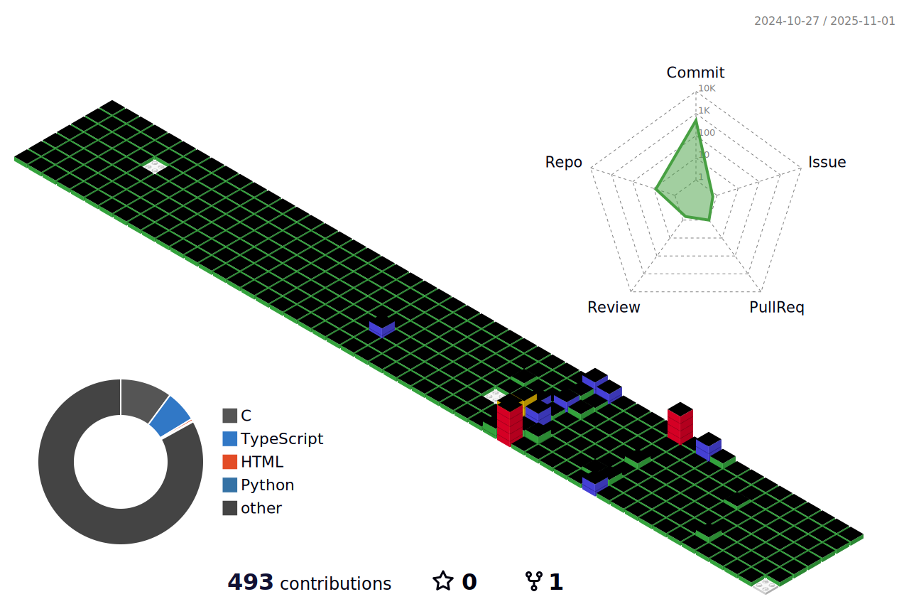

  

   
  
  

 

 

💡 𝙸 𝚖𝚊𝚓𝚘𝚛𝚎𝚍 𝚒𝚗
- ⚡ ***Electronic Engineering***  Embedded System Engineering @Tech University of Korea 

 

✏️ 𝙸'𝚖 𝚜𝚝𝚞𝚍𝚢𝚒𝚗𝚐...

- 🖥️ I'm currently focusing on **Defense Industry SW**
- 🌱 I’m currently learning **C/C++, Enmedded System, RTOS**
- 🧑‍💻 **SK SUNI C 4TH** @Seoul 2025.06~
- 🧑‍💻 **Techeer AI SW** @Seoul 2025.07~

 

🛠️ 𝚂𝚔𝚒𝚕𝚕𝚜 & 𝚃𝚘𝚘𝚕𝚜

    

  

     

 

🌐 𝙲𝚘𝚗𝚝𝚊𝚌𝚝 & 𝙻𝚒𝚗𝚔𝚜

 
 

💻 𝙼𝚢 𝙲𝚘𝚗𝚝𝚛𝚒𝚋𝚞𝚝𝚒𝚘𝚗𝚜

